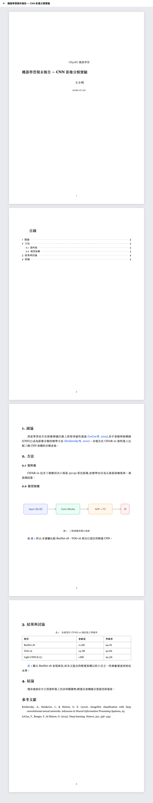
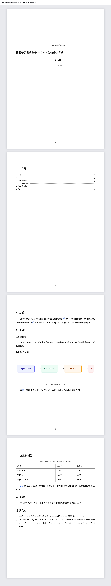

# open-report

[](https://github.com/open-report/open-report/stargazers)
[](https://github.com/open-report/open-report/network/members)
[](https://opensource.org/licenses/MIT)

**The report framework built for agents.** Describe your report in natural language — your coding agent writes the MDX. open-report handles pagination, citations, numbering, table of contents, and export to PDF so the agent can focus on content.

```bash
npx @open-report/cli init my-report
```

<table>
<tr>
<td align="center"><strong>APA</strong></td>
<td align="center"><strong>GB/T 7714</strong></td>
</tr>
<tr>
<td></td>
<td></td>
</tr>
</table>

> Same MDX source, different citation style — switch with one line of front-matter.

## Why not just ask your agent to write LaTeX?

Asking an agent to write LaTeX or script a docx gives you a **one-time output**: correct the moment it's generated, but reports are revised — advisors give feedback, data gets updated, sections get rearranged. Each revision means recompiling through cryptic errors or re-running a script that overwrites your manual fixes. The agent re-solves the same formatting problems every time and makes different mistakes each time.

open-report moves "formatting correctness" from the agent's job into the framework's structure. The agent can only write content (MDX) — it has no way to write section numbers, page numbers, or citation formats — so those are always correct. Your report becomes a **project you iterate on**, not a disposable artifact: change the content, everything else follows automatically.

This matters to the agent too. LaTeX's error messages are notoriously inscrutable; agents burn tokens looping through compilation failures. OOXML is sprawling enough that agents routinely produce files Word can't open. open-report's file contract — a single MDX file with eight components — is designed for the agent to get it right on the first try. Skills feed it the rules; the framework enforces them.

## Highlights

### 🤖 Agent-native authoring

Works with any coding agent (Claude Code, Codex, Cursor, …). The scaffolder ships with built-in skills:

- **`create-report`** — drafts a report end-to-end. Asks four scoping questions (type, citation style, length, language), plans the structure, and writes the pages.
- **`report-authoring`** — the technical reference for the file contract, components, citations, and typography rules. The agent reads this before writing.

From a one-line prompt to a submission-ready PDF, no boilerplate.

### 📄 Real pagination

Live A4/Letter preview in the browser with margins, running headers, and page numbers. The agent writes flow; the framework manages pages. Save the file, see the re-paginated result instantly.

### 🔢 Everything auto-numbered

Sections, figures, tables, cross-references, and the table of contents never go out of sync. The agent writes `<Cite id="..." />` and `<Ref to="..." />`; the framework renders the numbers.

### 📚 Citations that just work

Drop a `references.bib`, cite with `<Cite id="..." />`, and pick APA / MLA / Chicago / GB/T 7714 in front-matter. Inline citations and the bibliography are generated by citeproc — structurally impossible to get wrong.

### 🈶 CJK typography done right

First-line indent, punctuation rules, mixed CJK/Latin spacing — all out of the box. `lang: zh-TW` in front-matter and you're done.

### 📦 Export

Print-ready PDF (via headless Chrome) and self-contained static HTML. (docx export is on the roadmap.)

## Get started

```bash
npx @open-report/cli init my-report
cd my-report
pnpm install
pnpm dev
```

The scaffolded workspace ships with agent skills preconfigured for Claude Code. From there you drive the report through your agent — or edit `reports/<id>/index.mdx` directly. See [CLAUDE.md](CLAUDE.md) for the agent guide.

To export:

```bash
pnpm run export          # PDF by default
pnpm run export -- --format html
```

## Repo layout

This repo is a pnpm + Turbo monorepo.

| Path                          | Package               | Description                                                                        |
| ----------------------------- | --------------------- | ---------------------------------------------------------------------------------- |
| [packages/core](packages/core) | `@open-report/core` | Runtime (paged preview, reading mode), Vite plugin,`open-report` dev/export CLI. |
| [packages/cli](packages/cli)   | `@open-report/cli`  | `npx @open-report/cli init` scaffolder + project template.                       |
| [apps/demo](apps/demo)         | private               | Example reports that exercise the framework during development.                    |

## Development

```bash
pnpm install
pnpm dev        # runs the demo against local @open-report/core
pnpm build      # builds all packages
pnpm check      # biome (format + lint)
pnpm typecheck  # tsc across the monorepo
```

## Roadmap

See [docs/product.md](./docs/product.md) for the full roadmap — Inspector comment loop (0.2), docx export (0.3), template system (0.4), and more.

## License

MIT
